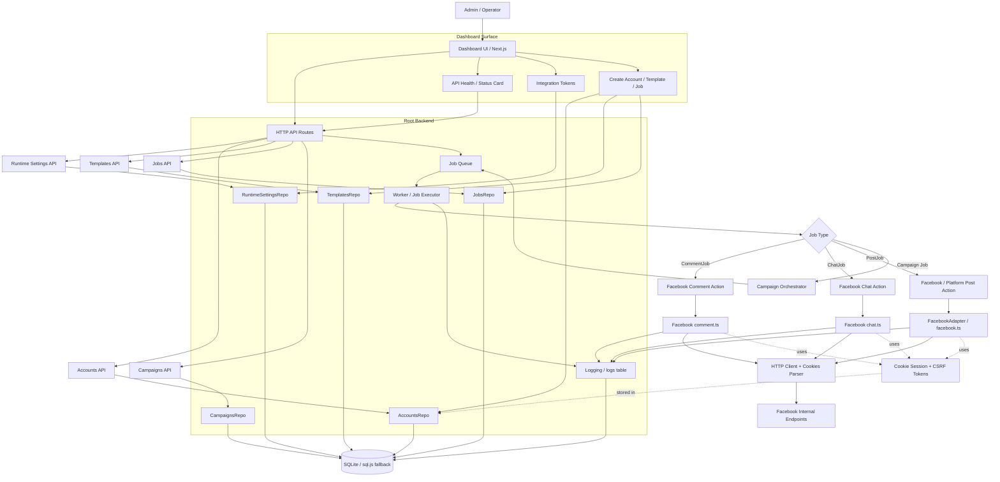

# 🚀 4x-blast-engine

Welcome! This is the **4x-blast-engine** repository. This page provides a simple entry point to navigate the project and get started quickly.

---

## 🚀 Quick Start

To launch the project, use the following commands:

- **On Linux/MacOS**:
  ```bash
  ./start.sh
  ```

- **On Windows**:
  ```powershell
  .\start.ps1
  ```

---

## 🏗 System Architecture



---

## 📂 Documentation Index

### Design & Architecture
- [Architecture Overview](docs/design/architecture.md)
- [Data Flow Analysis](docs/design/data-flow.md)
- [System Scaling](docs/design/scaling.md)
- [Security & Stealth](docs/design/security.md)

### Guides & Decision Records
- [ADR Index](docs/decisions/AGENTS.md)
- [Facebook Cookie Adapter Guide](docs/facebook-cookie-adapter-guide.md)
- [Development Workflow](docs/planning/GUIDE.md)

---

## 🎥 Product Walkthrough

The **4x-blast-engine** is a production-ready social media automation suite. 

### 🎥 Live Facebook Blast

*Visualizing automated target identification and multi-action engagement.*

### 📊 Real-time Analytics Dashboard

*Track CTR, success rates, and lead conversion funnels across all platforms.*

### 📋 Detailed Execution Logging

*Monitor every automated action with full error persistence and trace visibility.*

---

For more details, visit the corresponding sections in the `docs/` folder.

© 2026 **4yangXYAO Automation**. All Rights Reserved.
