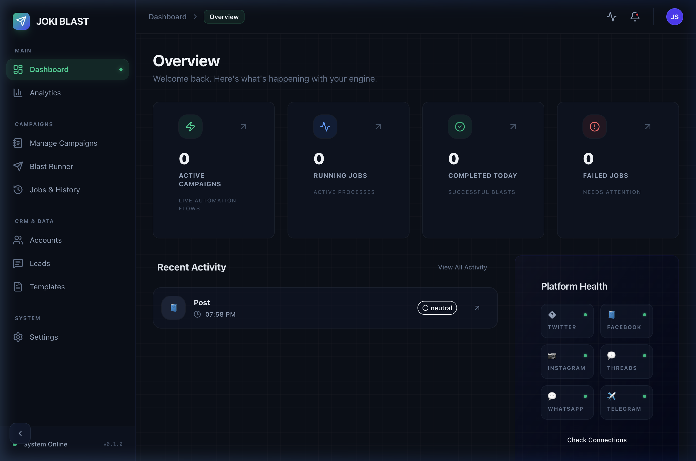
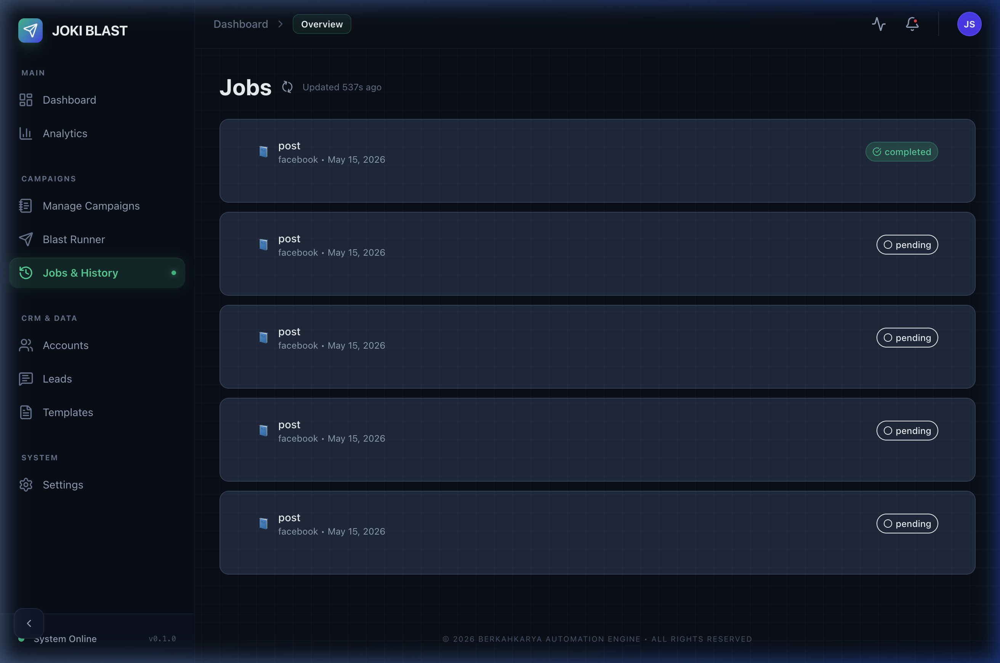

# Joki Blast Engine

Welcome! This is the Joki Blast Engine repository. This page provides a simple entry point to navigate the project and get started quickly.

---

## Quick Start

To launch the project, use the following commands:

- On Linux/MacOS:
```bash
./start.sh
```

- On Windows:
```powershell
.\start.ps1
```

---

## Documentation Index

### Design & Architecture
- [Architecture](docs/design/architecture.md)
- [Data Flow](docs/design/data-flow.md)
- [Scaling](docs/design/scaling.md)
- [Security](docs/design/security.md)

### Guides & Planning
- [Development Guide](docs/planning/GUIDE.md)
- [Glossary](docs/design/GLOSSARY.md)

### Reports
- [Implementation Summary](docs/reports/IMPLEMENTATION_SUMMARY.md)
- [Testing Summary](docs/reports/TESTING_SUMMARY.md)

### Decision Records
- [ADR Index](docs/decisions/AGENTS.md)
- [ADR-0006: Facebook Cookie Auth](docs/decisions/ADR-0006-facebook-cookie-auth.md)
- [ADR-0007: Blast Runner Architecture](docs/decisions/ADR-0007-blast-runner-architecture.md)

---

## Product Walkthrough

The Joki Blast Engine is a production-ready social media automation suite. Below is the updated feature set for our Facebook implementation:

*   **Unified Multi-Mode Adapter**: Supports both high-speed HTTP (GraphQL) and high-robustness BROWSER (Playwright).
*   **Advanced Target Discovery**: Search by date, author, and group relevance with automated lead extraction.
*   **Deep Engagement**: Automated comments, private messages, post reactions (Like/Love/etc.), and status updates.
*   **Real-time Observability**: Comprehensive job tracking with detailed error traces and a live analytics dashboard.

### 🎥 Live Facebook Blast

*Visualizing automated target identification and multi-action engagement.*

### 📊 Real-time Analytics Dashboard

*Track CTR, success rates, and lead conversion funnels across all platforms.*

### 📋 Detailed Execution Logging

*Monitor every automated action with full error persistence and trace visibility.*

---

For more details, visit the corresponding sections in the `docs/` folder.