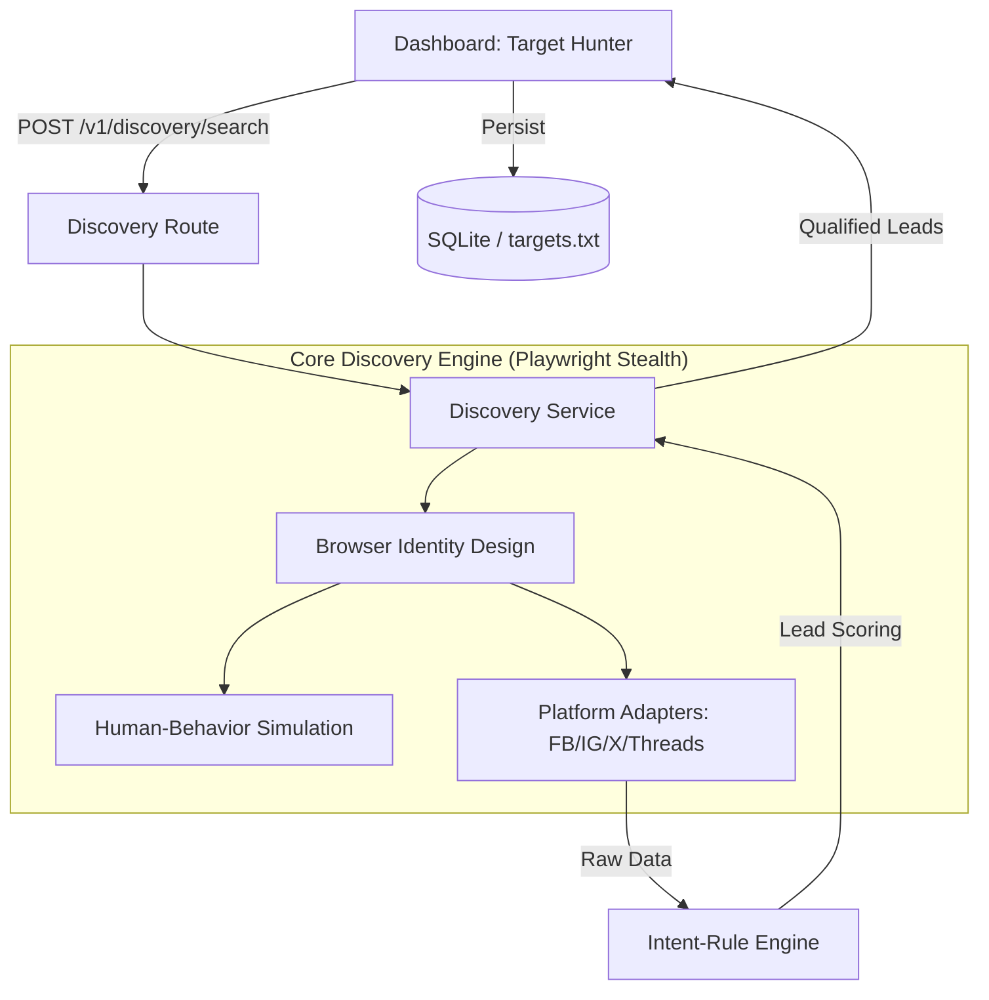

# Master Specification: "The Sniper Discovery" Engine

Sistem ini dirancang untuk mengubah profil *Social Media Blast* dari sekadar "penyebar pesan" menjadi **"Pendeteksi Niat" (Intent-Based Targeting)** yang presisi, aman, dan berkelanjutan.

---

## 1. Arsitektur Teknis (High-Level)

---

## 2. Core Pillars (Pilar Utama)

### Layer 1: Stealth & Identity Design
Guna menghindari deteksi bot modern (Meta/X), sistem ini tidak lagi menggunakan request HTTP biasa, melainkan menggunakan browser otomatis yang disamarkan.
*   **Infrastructure**: Menggunakan `Playwright Extra` + `Stealth Plugin`.
*   **Persona Persistence**: Menyimpan status session (cookies, IDB) per akun untuk membangun reputasi akun yang konsisten di mata provider.
*   **Behavioral Jitter**: Simulasi gerakan manusia (scrolling acak, mouse hover, variable delays) untuk memecah pola robotik.

### Layer 2: Intent-Rule Engine (Detecksi Niat)
Mendeteksi potensi "Closing" tanpa menggunakan AI eksternal, sehingga tetap cepat dan 100% lokal.
*   **Targeting Strategy**: Fokus pada "Kolam" (Postingan Iklan/Viral) bukan pencarian profil acak.
*   **Scoring Logic**:
    *   **Inquiry Keywords**: `siapa`, `rekomendasi`, `info`, `tanya` (+20).
    *   **Buying Intent**: `harga`, `berapa`, `min`, `jasa`, `beli` (+50).
    *   **Negative Filter**: `gratis`, `free`, `promo` (Exclude).
*   **Output**: Target diklasifikasikan menjadi *High Value*, *Potential*, atau *Noise*.

### Layer 3: Sniper Strategy (Cari Kolam Bukan Ikan)
Strategi ini mengasumsikan bahwa orang yang paling relevan adalah mereka yang sedang aktif berinteraksi di konten yang serupa dengan niche kita.
1.  **Scout**: Temukan postingan dengan engagement tinggi berdasarkan keyword.
2.  **Harvest**: Ekstrak komentator yang aktif di postingan tersebut.
3.  **Validate**: Scoring akun berdasarkan bio dan riwayat interaksi singkat.

---

## 3. Technology Stack (Pragmatic & Matang)

| Komponen | Tool / Spesifikasi | Rationale |
|----------|-------------------|-----------|
| **Automation Engine** | Playwright (Playwright-Extra) | Bypass detection lebih baik dari Axios/Selenium. |
| **Stealth Layer** | Puppeteer-extra-plugin-stealth | Patching `navigator.webdriver` dan ciri bot lainnya. |
| **Logic Engine** | Node.js (Regex + Keyword Matrix) | Ringan, cepat, dan 100% lokal (No AI Cost). |
| **Dashboard** | Next.js (Dashboard V2) | Interface real-time buat monitoring progress hunter. |
| **Database** | SQLite & targets.txt | Persistensi data target yang sudah ter-score. |

---

## 4. Operational Safety (Keamanan Akun)

*   **Cooling Down**: Jeda otomatis 30-60 menit setelah sesi scraping intensif.
*   **Account Rotation**: Menggunakan akun berbeda untuk fase *Scouting* dan fase *Blasting*.
*   **Hard Limits**: Maksimal 30 target berkualitas per akun per sesi discovery.

---
**Status Dokumen**: `FINAL - READY FOR EXECUTION`
**Target Pilot**: Facebook & Instagram Sniper Discovery.